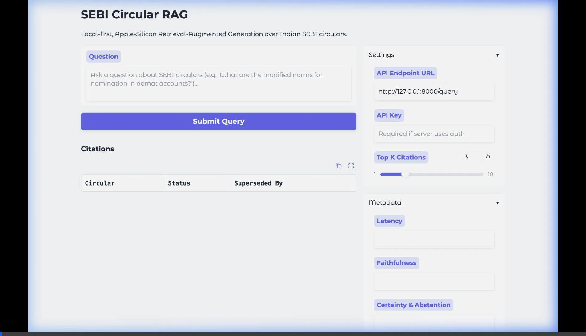

# SEBI Circular RAG

A local-first, Apple-Silicon Retrieval-Augmented Generation system over Indian SEBI circulars. It scrapes official circulars, segments and indexes them, retrieves with hybrid search + cross-encoder reranking, generates grounded answers with an abstention gate, and returns citations with supersession status and a faithfulness check — behind a config-driven, authenticated FastAPI service.

## Walkthrough

## Getting Started

See `docs/USAGE.md` for full installation and usage instructions.

### Quick Start
1. `make serve` to start the FastAPI backend
2. `make ui` to start the Gradio UI dashboard
